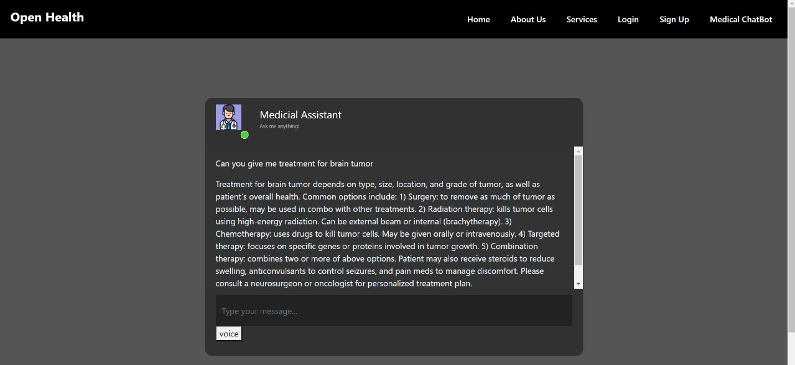

# OpenHealth
This is a Multi-Modal website for doctors that helps in diagnosing and giving them a second opinion. Our platform comprises four AI detection models tailored to different medical domains:

🧠 Brain Tumour Detection Using Image Segmentation: Utilizing cutting-edge image segmentation techniques, this model can accurately identify and localize brain tumors from medical imaging data.

🫁 Lung Disease Detection Using Random Forest: Employing a robust random forest algorithm, this model aids in the early detection and classification of lung diseases based on diverse medical features.

🩺 Breast Cancer Detection Using SVM: Leveraging support vector machine (SVM) technology, this model offers precise detection and analysis of breast cancer patterns, enhancing early diagnosis and treatment planning.

🩸 Diabetes Detection Using Ensemble Models: By combining multiple predictive models into an ensemble, this tool enables reliable prediction of diabetes risk factors, facilitating proactive management and prevention strategies.

Additionally, OpenHealth features a dedicated medical assistant powered by Llama-3, our AI chatbot. Llama-3 is finely tuned to provide personalized assistance to medical professionals, capable of accepting voice inputs and delivering expert advice akin to a doctor's guidance. This feature enhances communication and collaboration between healthcare providers, ensuring efficient patient care.

We also provide a notification section for doctors to ask help from other doctors based on their specialization.
