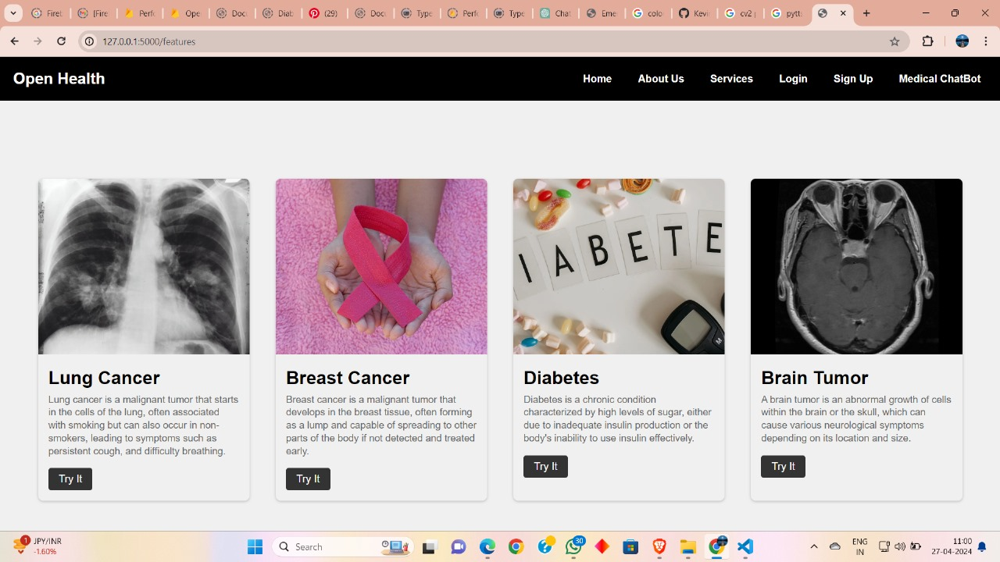

# OpenHealth

Welcome to **OpenHealth**, an innovative platform that empowers medical professionals with cutting-edge AI tools to assist in diagnosis, second opinions, and patient care. OpenHealth features a sophisticated **AI-powered chatbot** as its centerpiece, offering a seamless and intelligent experience for doctors and healthcare providers.

## Key Features

### **AI Chatbot - The Heart of OpenHealth** [Model link](https://huggingface.co/kevinjoythomas/medical-loratuned-chatbot-GGUF)

At the core of OpenHealth lies an advanced **AI chatbot**, designed to enhance the decision-making process for medical professionals and paitents. This chatbot is **LoRA fine-tuned**  with the **unsloth package**, on a **Dataset of 112,000 Rows** ensuring an exceptional user experience.

**Key Highlights:**

- **Retrieval-Augmented Generation (RAG):** The chatbot leverages RAG to pull relevant information from **21 carefully curated PDFs**, ensuring that responses are accurate, detailed, and up-to-date.
- **Context-Aware Conversations:** It tracks and stores chat history, allowing continuous, meaningful dialogues and enabling context-sensitive responses.
- **Fast Response Time:** With an impressive **average response time of 42 seconds**, powered by the **LangChain framework**, the chatbot provides efficient, real-time assistance.

---

### **Medical AI Models for Diagnosis and Second Opinions**

OpenHealth is not just a chatbot. It also integrates four sophisticated AI detection models tailored to different medical domains, assisting doctors in making accurate diagnoses and providing second opinions with confidence.

#### 🧠 **Brain Tumor Detection Using Image Segmentation**

This state-of-the-art model utilizes **advanced image segmentation techniques** to detect and localize **brain tumors** from medical imaging data. It provides accurate results, aiding in early diagnosis and treatment planning.

#### 🫁 **Lung Disease Detection Using Random Forest**

Leveraging the **Random Forest algorithm**, this model assists in the **early detection and classification** of lung diseases by analyzing diverse medical features. It helps in identifying critical conditions, leading to timely medical interventions.

#### 🩺 **Breast Cancer Detection Using SVM**

This powerful model uses **Support Vector Machine (SVM)** technology to detect and analyze **breast cancer** patterns. It enables doctors to make accurate assessments, improving early diagnosis and guiding treatment decisions.

#### 🩸 **Diabetes Detection Using Ensemble Models**

By combining multiple predictive models into an **ensemble**, this model enhances the prediction of **diabetes risk factors**, enabling doctors to identify early symptoms and implement proactive management and prevention strategies.

---

### **Notification System for Doctor Collaboration**

OpenHealth also features a **dedicated notification system** that allows doctors to reach out to their peers based on specialization. This feature encourages **collaboration** among medical professionals, ensuring that every patient receives the best possible care through consultation and shared expertise.

---

OpenHealth is designed to help doctors provide the best care possible, enhancing diagnosis accuracy and treatment efficiency with the power of artificial intelligence.
