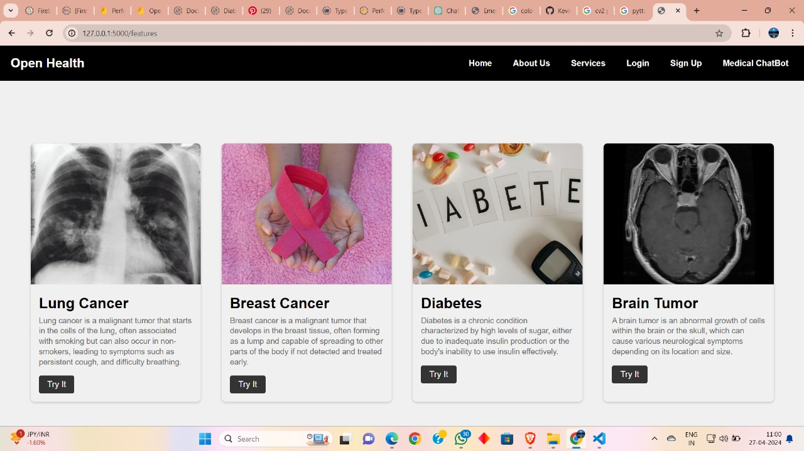

<<<<<<< HEAD
# OpenHealth — Microservices Monorepo

Medical chat platform built with Flask microservices, Postgres, Redis, RabbitMQ, ChromaDB, and a LORA-fine-tuned LLaMA3 7B model.

> **Previous monolith** lives in `website/` for reference. The active codebase is `services/`.

## Architecture

```
api-gateway  (:5000)   →  auth-service       (:5001)
                        →  chat-orchestrator  (:5002)
                              └→ retrieval-service  (:5003)
                              └→ Ollama (host)
ingestion-worker (Celery)  ←  RabbitMQ
```

| Service | Port | Responsibility |
|---|---|---|
| api-gateway | 5000 | JWT validation, rate limiting, reverse proxy |
| auth-service | 5001 | Signup/login, JWT issue/refresh, bcrypt passwords |
| chat-orchestrator | 5002 | Chat sessions (Postgres + Redis), RAG pipeline |
| retrieval-service | 5003 | ChromaDB hybrid search (BM25 + vector + RRF) |
| ingestion-worker | — | Celery worker: S3 → chunk → embed → ChromaDB |

## Prerequisites

- Docker 24+ and Docker Compose v2
- Ollama running on the host with models pulled:
  ```bash
  ollama pull hf.co/kevinjoythomas/medical-loratuned-chatbot-GGUF
  ollama pull nomic-embed-text
  ```

## Quick Start

```bash
# 1. Copy and configure environment variables
cp .env.example .env
# Edit .env — at minimum set JWT_SECRET and database passwords

# 2. Build and start all services
make build
make up

# 3. Run database migrations
make migrate

# 4. Check service health
curl http://localhost:5000/health
```

## API

Base URL: `http://localhost:5000/v1`

Full OpenAPI spec: [docs/api-spec.yaml](docs/api-spec.yaml)

### Auth
- `POST /v1/auth/signup` — Register user
- `POST /v1/auth/login` — Login, receive JWT pair
- `POST /v1/auth/refresh` — Rotate refresh token
- `GET  /v1/auth/me` — Current user profile

### Chat
- `POST   /v1/chat/sessions` — Create new chat session
- `GET    /v1/chat/sessions` — List user sessions
- `POST   /v1/chat/sessions/{id}/messages` — Send message (RAG response)
- `GET    /v1/chat/sessions/{id}/messages` — Get message history
- `DELETE /v1/chat/sessions/{id}` — Delete session

### Ingestion
- `POST /v1/ingest/document` — Enqueue document for ingestion

## Useful Commands

```bash
make logs          # Tail all service logs
make logs-chat     # Tail a specific service
make test          # Run all test suites
make migrate       # Run Alembic migrations
make shell-auth    # Open shell in auth-service container
make clean         # Remove containers + volumes
```
=======
# OpenHealth 🏥

Welcome to **OpenHealth**, an innovative platform that empowers medical professionals with cutting-edge AI tools to assist in diagnosis, second opinions, and patient care. OpenHealth features a sophisticated **AI-powered chatbot** as its centerpiece, offering a seamless and intelligent experience for doctors and healthcare providers.

## Key Features

### **AI Chatbot - The Heart of OpenHealth** [Model link](https://huggingface.co/kevinjoythomas/medical-loratuned-chatbot-GGUF) 🤖

At the core of OpenHealth lies an advanced **AI chatbot**, designed to enhance the decision-making process for medical professionals and paitents. This chatbot is **LoRA fine-tuned**  with the **unsloth package**, on a **Dataset of 112,000 Rows** ensuring an exceptional user experience.

**Key Highlights:**

- **Retrieval-Augmented Generation (RAG):** The chatbot leverages RAG to pull relevant information from **21 carefully curated PDFs**, ensuring that responses are accurate, detailed, and up-to-date.
- **Context-Aware Conversations:** It tracks and stores chat history, allowing continuous, meaningful dialogues and enabling context-sensitive responses.
- **Fast Response Time:** With an impressive **average response time of 42 seconds**, powered by the **LangChain framework**, the chatbot provides efficient, real-time assistance.


---

### **Medical AI Models for Diagnosis and Second Opinions**

OpenHealth is not just a chatbot. It also integrates four sophisticated AI detection models tailored to different medical domains, assisting doctors in making accurate diagnoses and providing second opinions with confidence.

#### 🧠 **Brain Tumor Detection Using Image Segmentation**

This state-of-the-art model utilizes **advanced image segmentation techniques** to detect and localize **brain tumors** from medical imaging data. It provides accurate results, aiding in early diagnosis and treatment planning.

#### 🫁 **Lung Disease Detection Using Random Forest**

Leveraging the **Random Forest algorithm**, this model assists in the **early detection and classification** of lung diseases by analyzing diverse medical features. It helps in identifying critical conditions, leading to timely medical interventions.

#### 🩺 **Breast Cancer Detection Using SVM**

This powerful model uses **Support Vector Machine (SVM)** technology to detect and analyze **breast cancer** patterns. It enables doctors to make accurate assessments, improving early diagnosis and guiding treatment decisions.

#### 🩸 **Diabetes Detection Using Ensemble Models**

By combining multiple predictive models into an **ensemble**, this model enhances the prediction of **diabetes risk factors**, enabling doctors to identify early symptoms and implement proactive management and prevention strategies.



---

### **Notification System for Doctor Collaboration**

OpenHealth also features a **dedicated notification system** that allows doctors to reach out to their peers based on specialization. This feature encourages **collaboration** among medical professionals, ensuring that every patient receives the best possible care through consultation and shared expertise.

---

OpenHealth is designed to help doctors provide the best care possible, enhancing diagnosis accuracy and treatment efficiency with the power of artificial intelligence.
>>>>>>> 7eb148395d859928bd181af2fa3e4f00cd82669e
